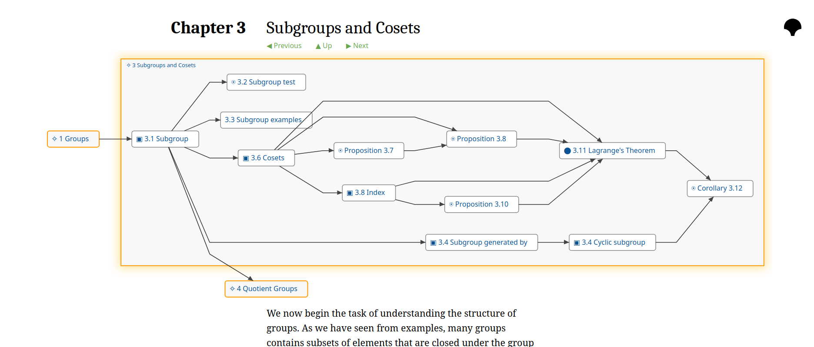

# Tarskido

**Tarskido** is an experimental platform for authoring and reading mathematics books or notes as a directed graph of definitions and propositions. It aims to make the natural graph structure of mathematical knowledge an explicit part of learning and reading. I've built this as a personal project, and have found it a useful way to organise my notes while study new topics. If you find it useful, or if you have any feedback or suggestions, I'd love to hear from you!



## Features
- **Graph-based navigation** of mathematical content, with visualisations powered by the wonderful [dagre](https://github.com/dagrejs/dagre) layout engine.
- **Structural references** between nodes.
- **Dependency-away layout**: For example, view the prerequisites of a definition or theorem in a natural ordered on a single page.
- **In-browser editing**, with content rendered via [markdown-it](https://github.com/markdown-it/markdown-it) and [katex](https://katex.org/).
- **Local-first**: Books live in local storage and can be edited and viewed offline, or exported as JSON and shared with others.

## Demo

https://grge.github.io/tarskido/

## Installation

You can run Tarskido locally:

```bash
git clone https://github.com/grge/tarskido.git
cd tarskido
npm install
npm run dev
```
